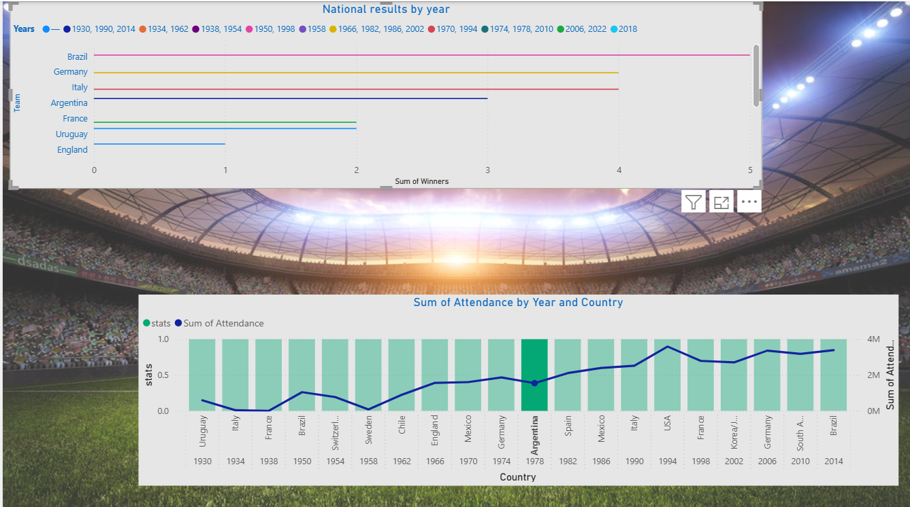
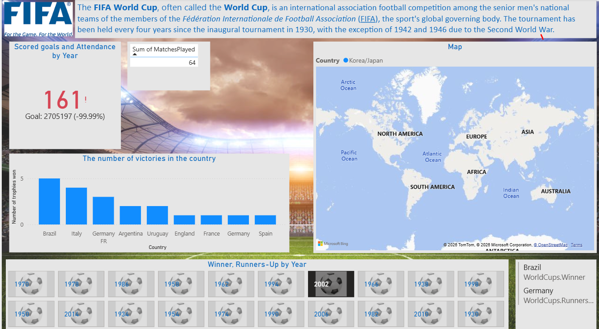

# Power BI TalTech Project

## Project overview

This repository documents my practical work and learning outcomes from the TalTech course **Data Visualization with Power BI** (*Andmete visualiseerimine Power BI abil*).

The course covered the complete Power BI workflow: importing data, assessing and improving data quality, transforming data in Power Query, creating visualizations, writing DAX measures, and preparing reports for publication in Power BI Service.

> **Status:** Course completed with a final score of 96%. 

## Project objective

The objective was to transform raw data into a clear, interactive, and informative Power BI report. The work followed a typical business intelligence process:

1. Import data from source files or web sources.
2. Review the structure, data types, and overall data quality.
3. Clean and transform the data in Power Query.
4. Create suitable visualizations and organize them into report pages.
5. Create calculated measures using DAX.
6. Evaluate whether the report communicates its main findings clearly.
7. Prepare the report for publication in Power BI Service.

## Tools and technologies

- **Power BI Desktop** — data modelling, analysis, and report development
- **Power Query** — data cleaning and transformation
- **DAX** — calculated measures and analytical formulas
- **M language** — custom transformations in Power Query
- **Power BI Service** — publishing and sharing reports
- **Microsoft Excel** — source data format
- **GitHub** — project documentation and portfolio presentation

## Skills demonstrated

- Selecting appropriate charts for different analytical questions
- Applying data visualization principles and avoiding misleading charts
- Importing structured data from local files and web sources
- Identifying missing values, errors, inconsistent formats, and incorrect data types
- Cleaning and transforming data with Power Query
- Creating custom columns using Power Query and M language
- Building and formatting interactive Power BI visuals
- Applying filtering, sorting, drill-down, and hierarchies
- Creating reusable DAX measures
- Organizing a report into clear and readable pages
- Understanding the roles of Power BI Desktop, Power BI Service, and Power BI Mobile

## Learning journey

| Week | Main topics | Practical outcome |
|---|---|---|
| 1 | Visualization principles, chart types, common mistakes, and Power BI architecture | Learned how to select and evaluate visualizations and created a first Power BI visual |
| 2 | Data types, file formats, local and web data sources, and core visuals | Imported data from different sources and practised Power BI's main visual types |
| 3 | Data preprocessing, the Power Query interface, and data-quality profiling | Loaded, reviewed, and cleaned the project data |
| 4 | Visual design, report interactions, and hierarchies | Built and formatted the main report visuals |
| 5 | Power Query built-in functions and M language | Performed additional transformations and created custom columns |
| 6 | DAX fundamentals and measures | Created calculated measures to support the analysis |
| 7 | Power BI Service and Power BI Mobile | Learned how reports are published, shared, and viewed across devices |
| 8 | Final project | Combined the complete workflow into a Power BI project |

## Final project

### Project topic

**FIFA World Cup Match Results**

The project analyzes FIFA World Cup matches played between **1930 and 2014**. The purpose of the Power BI report is to explore historical tournament results, compare national teams, and identify patterns in match outcomes and goal scoring.

### Analytical questions

The report aims to answer questions such as:

- Which national teams achieved the most wins?
- Which teams scored the most goals?
- How did the number of matches and goals change across tournaments?
- Which tournaments had the highest average number of goals per match?
- Which host countries, cities, and stadiums held the most matches?
- How frequently did matches end in a draw?
- Which national teams appeared most often in World Cup matches?

### Dataset

The dataset contains historical FIFA World Cup match results from **1930 to 2014**.

- **Original file:** `world-cup-results.xlsx`
- **Source:** data.world — Sports Viz Sunday 2018
- **Coverage:** FIFA World Cup matches and results from 1930 to 2014
- **File format:** Microsoft Excel (`.xlsx`)

The dataset was imported into Power BI and prepared for analysis using Power Query.

### Project files

- [Download the Power BI report](fifa-world-cup-analysis.pbix)
- [Download the Excel dataset](world-cup-results.xlsx)

### Data preparation

The data preparation process included:

- verifying and correcting column data types;
- identifying missing or invalid values;
- standardizing text, date, and numerical formats;
- removing unnecessary rows or columns;
- creating additional calculated columns where required;
- preparing the data for analysis and visualization.

### DAX measures

DAX measures were used to calculate and compare key World Cup statistics.

Example:

```DAX
Total Goals =
SUM('World Cup Results'[Home Team Goals])
    + SUM('World Cup Results'[Away Team Goals])
```

> The table and column names shown above are an example and may differ from the names used in the final Power BI data model.

### Dashboard

The report presents historical FIFA World Cup results through interactive visualizations.

#### Dashboard overview



#### Geographical analysis



## Repository contents

```text
PowerBI-school-project-TalTech/
├── README.md
├── dashboard-overview.PNG
├── fifa-world-cup-analysis.pbix
├── map-analysis.PNG
└── world-cup-results.xlsx
```

## Course information

- **Institution:** Tallinn University of Technology (TalTech)
- **Course:** Data Visualization with Power BI
- **Instructor:** Olga Dunajeva
- **Final score:** 96%
- **Main areas:** data visualization, Power Query, M language, DAX, Power BI Desktop, Power BI Service, and Power BI Mobile

## Author

**Evelyn Uusmaa**

Accounting professional transitioning into data analytics, with practical experience in financial data and developing skills in Power BI, SQL, and Python.
